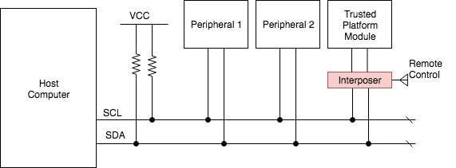

# TPM Genie

TPM Genie is designed to aid in vulnerability research of Trusted Platform Modules. As a serial bus interposer, TPM Genie is capable of intercepting and modifying all traffic that is sent across the I2C channel between the host machine and a discrete TPM chip. 

Outside of research, the threat model demonstrated by TPM Genie would require an attacker to have temporary physical access to the affected machine in order to implant the interposer device. Such an attack could be conducted in an "[Evil Maid](https://theinvisiblethings.blogspot.ca/2009/01/why-do-i-miss-microsoft-bitlocker.html)" scenario, by a rogue employee in a datacenter containing TPM enabled enterprise servers, or by a [supply chain interdiction attack](https://www.theguardian.com/books/2014/may/12/glenn-greenwald-nsa-tampers-us-internet-routers-snowden) in the style of those found in the [NSA ANT catalog](https://en.wikipedia.org/wiki/NSA_ANT_catalog) of hardware implants.

Many discrete TPMs are broken out to a daughter card that is connected to the main board via a simple header or socket. Consequently, the process of implanting an interposer is fairly straight forward as it would not require the attacker to perform any circuit modification attacks. The implant could be installed in only a few seconds.

TPM Genie was tested extensively with the Infineon SLB9645 I2C TPM, which conforms to the TPM v1.2 protocol specification.

# Key Features

This tool was  primarily developed to manipulate TPM response packets in order to trigger parsing bugs in the host-side TPM drivers. These bugs can be found in the Linux kernel, as well as a variety of bootloaders such as Tboot and Tianocore EDKII. Leveraging these vulnerabilities, an attacker may be able to compromise a host machine after it had successfully booted up into a fully measured and attested state.

TPM Genie is also able to man-in-the-middle PCR Extend operations, yielding the ability to undermine most of the stated purposes of a TPM: measured boot, remote attestation, and sealed storage. Normally, attestation or unsealing should fail if an attacker modifies any component of the measured boot process. However, the interposer makes it is possible to spoof these measurements by replacing the the payload associated with the PCR Extend ordinal as it is transmitted across the bus.

Additionally, TPM Genie can weaken the Linux hardware random number generator. On some systems, `/dev/hwrng` is tied into the Trusted Platform Module such that all reads on the character device will actually result in the TPM chip providing the random bytes. In this way, the interposer can subtly alter the platform's RNG which may impair cryptographic operations on the host.

Finally, TPM Genie can be used to simply sniff the bus to capture secrets, such as session data associated with the OIAP and OSAP commands. And with nominal additional engineering effort, TPM Genie should be able to spoof the Endorsement Key, gain control of the AuthData and recalculate the Authorization Session HMAC. (More info on that in my whitepaper. I promise I'll implement that soon).

## Further Information

- [TPM Genie Whitepaper](docs/NCC_Group_Jeremy_Boone_TPM_Genie_Whitepaper.pdf)
- [CanSecWest Slides](docs/CanSecWest_2018_-_TPM_Genie_-_Jeremy_Boone.pdf)
- [How to build TPM Genie](docs/Hardware_Build.md)
- [How to use TPM Genie](docs/Usage_Instructions.md)
- [TPM serial bus attack demonstrations](docs/Attack_Demonstrations.md)

