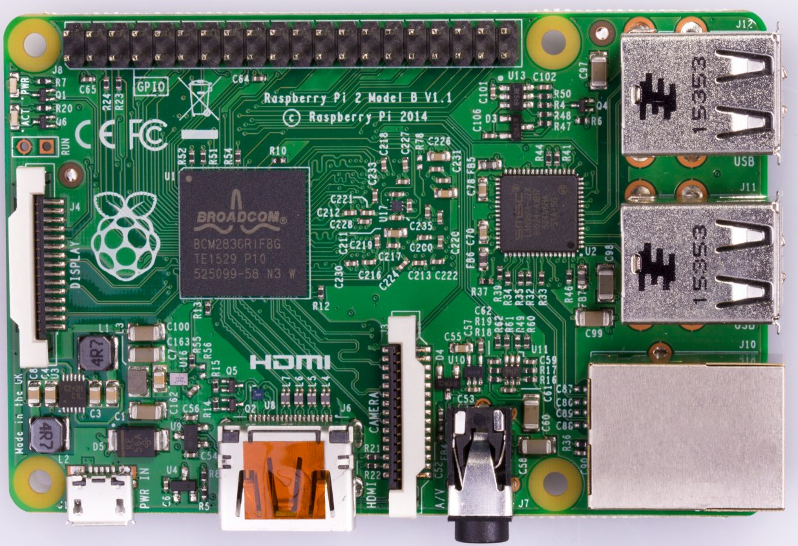
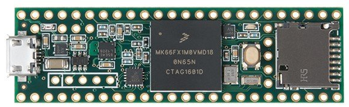
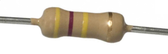
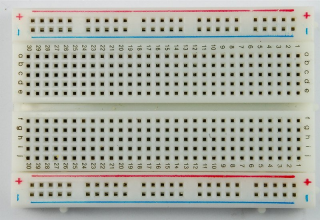
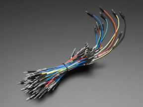
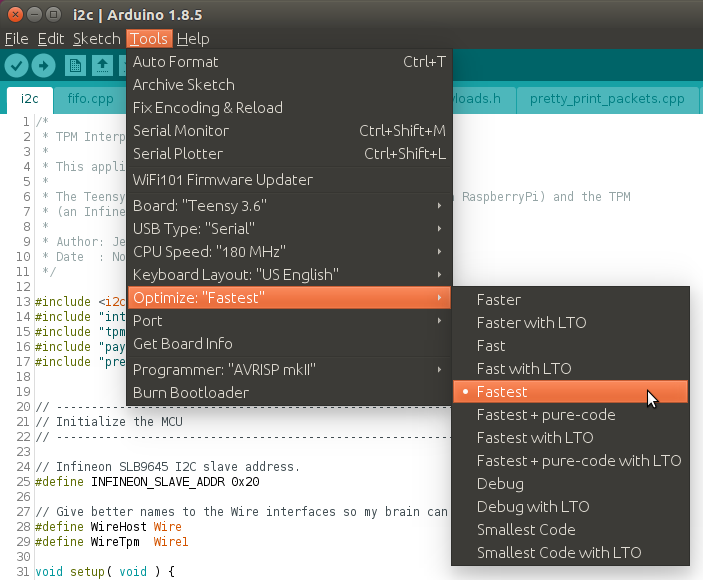
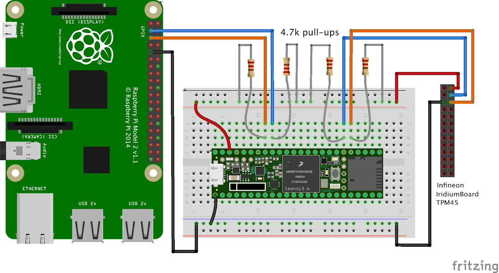
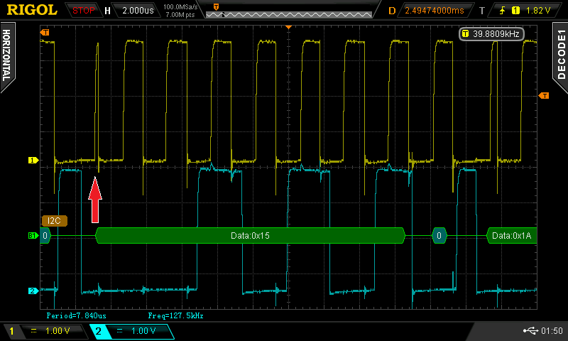

# Hardware Build Instructions

This section describes the process of designing and building the TPM Genie interposer device. Below you will find the parts list, circuit wiring guidance, locations to download the TPM Genie firmware, and instructions for compiling and flashing the microcontroller.


## Bill of Materials

I used the following hardware when developing this proof of concept. If you wish to recreate my findings, I suggest using the same kit. 

| Component     | Cost          | Picture |
| ------------- |:-------------:| -----:|
| [Raspberry Pi 2 Model B](https://www.raspberrypi.org/products/raspberry-pi-2-model-b/) (victim under test) | $40 |  |
| [Infineon TPM45 Iridium Board](https://www.infineon.com/cms/en/product/evaluation-boards/tpm-45-iridiumboard/) based on SLB9645 (victim under test) | $100 |  |
| [Teensy microcontroller](https://www.pjrc.com/store/teensy36.html) | $30 |  |
| [4.7k Ohm pull up resistor](https://www.digikey.ca/product-detail/en/te-connectivity-passive-product/CFR16J4K7/A105934CT-ND/3477497) (x4) | $1 |  |
| [Half-size breadboard](https://www.adafruit.com/product/64) | $5 |  |
| [Jumper wires](https://www.adafruit.com/?q=jumper%20wires) | $2 |  |

### Possible Substitutions

TPM Genie has only been tested in the above configuration. However, since the discovered vulnerabilities affect most discrete TPM hardware deployments, it should be possible to swap some of the above parts and still achieve the same results. Therefore, the following substitutions could theoretically be made:

- Replace the Raspberry Pi victim for a newer model, or even another Linux machine that has a header for a discrete TPM.
- Substitute the Teensy microcontroller for another Arduino device that is able to simultaneously communicate as master and slave on two independent I2C buses.
- Swap the Infineon TPM victim for any other I2C-capable discrete TPM (such as this [Atmel dev kit](http://ww1.microchip.com/downloads/en/DeviceDoc/Atmel-8528-TPM-I2C-SPI-Development-Kit-UserGuide.pdf)). 
- Many of the vulnerabilities revealed in the white paper also affect TPMs that communicate on the SPI or LPC bus. It should be possible to use the [Infineon Iridium SLB9670 dev kit](https://www.infineon.com/cms/en/product/evaluation-boards/iridium9670-tpm2.0-linux/), although this would require some nominal development effort to add support for the SPI protocol to TPM Genie’s Arduino sketch.


## Software and Hardware

The following process is intended to guide you through the process of building the interposer device. At a high level, these instructions will walk you through the following steps:

1. Configure the Infineon TPM to communicate with the Raspberry Pi.
2. Load the TPM Genie firmware onto the Teensy microcontroller.
3. Wire TPM Genie to act as a man-in-the-middle between the Raspberry Pi and the Infineon TPM daughter card.


### Step 1: Infineon TPM and Raspberry Pi

Before setting up the interposer, the first step is to simply allow the TPM to communicate with the Raspberry Pi kernel. You must ensure that the Raspian kernel driver can initialize properly and that you can run a few simple TPM commands from the RPi’s shell.

Start by following the [Infineon Iridium TPM45](http://www.infineon.com/dgdl/Infineon-+SLB+9645_SLB+9670+TPM+1.2+-AN-v06_16-EN.zip?fileId=5546d46255a50e820155b535d44d754f) setup instructions for the Raspberry Pi. This lengthy document will guide you through the entire process of compiling the kernel with the Infineon TPM kernel module, installing Raspian on an SD Card,  and connecting the TPM to the Raspberry Pi’s GPIO header.


### Step 2: Teensy Microcontroller

Start by installing the [Teensyduino](https://www.pjrc.com/teensy/td_download.html) IDE, which is necessary to compile the TPM Genie Arduino sketch and flash the Teensy microcontroller.

Next, clone this Git repository and open i2c.ino in the Teensyduino IDE. Compile the sketch to ensure you have all the necessary dependencies. The improved I2C library named [i2c_t3](https://github.com/nox771/i2c_t3), is necessary because Ardunio’s default Wire library cannot simultaneously make use of two I2C buses.

You will need to change the Teensyduino IDE to optimize the compiled firmware for speed. This can be accomplished by selecting the menu option shown below. This speed optimization is necessary due to the tight timing constraints in the kernel: After issuing a command to the TPM, the kernel driver will wait only for a limited amount of time for the response data to become available.



The second fix is to manually edit the header file named `i2c_t3.h`. Here we must increase the size of the I2C transmit and receive buffers. This is necessary because some TPM commands and responses exceed the default I2C buffer size for the i2c_t3 library.

```
i2c_t3.h /home/<user>/arduino-1.8.5/hardware/teensy/avr/libraries/i2c_t3/i2c_t3.h
80,81c80,81
< #define I2C_TX_BUFFER_LENGTH 259
< #define I2C_RX_BUFFER_LENGTH 259
---
> #define I2C_TX_BUFFER_LENGTH 2048
> #define I2C_RX_BUFFER_LENGTH 2048
```

Next, once you’ve verified that everything compiles properly, you should connect the Teensy to your development machine using the USB header. Load the sketch onto the Teensy. At this point, you should connect to the Teensy's serial console. You should see the Interposer present itself to you, with the following splash screen:

```
$ sudo minicom -D /dev/ttyACM0

***********************************************************************************
****                                 TPM Genie                                 ****
****                           Jeremy Boone, NCC Group                         ****
***********************************************************************************
[*] Initializing I2C bus #0 w/ RaspberryPi (slave)
[*] Initializing I2C bus #1 w/ TPM (master)
[*] Starting up in default state: PASSTHROUGH
[*]     You can press 'm' to switch states.
[*] Waiting for data...

/-------------------|--------|-------------------------------------------------\
|     Direction     |  reg   | data                                            |
|-------------------|--------|-------------------------------------------------|
```

### Step 3: Wiring the TPM Genie Interposer

First you should remove USB power from both the Teensy microcontroller and the Raspberry Pi. Now it is safe to disconnect the TPM from the GPIO header on the Raspberry Pi.

To assist in this stage, you should gather the pinout diagrams for the [Raspberry Pi 2 Model B](http://pi4j.com/pins/model-2b-rev1.html#J8_Pinout_40-pin_Header), [Teensy 3.6](https://www.pjrc.com/teensy/card9a_rev1.pdf), and [Infineon Iridium TPM45](http://www.infineon.com/dgdl/Infineon-+SLB+9645_SLB+9670+TPM+1.2+-AN-v06_16-EN.zip?fileId=5546d46255a50e820155b535d44d754f).





First, connect the I2C bus #0 on the Teensy microcontroller to the Raspberry Pi GPIO header using jumper wires.

| Raspberry Pi           | Teensy        |
| ---------------------- |:-------------:|
| SCL1 on GPIO 9 (pin 3) | SCL0 (pin 19) |
| SDA1 on GPIO 8 (pin 5) | SDA0 (pin 18) |
| GND (pin 9)            | GND           |

The Teensy microcontroller board has weak internal pull up resistors, so external pull ups are needed. Connect a 4.7k Ohm pull up resistor from the SCL0 and SDA0 to the 3.3V VCC line. A breadboard is useful for this.

Next, connect the Teensy I2C bus #1 to the TPM using jumper wires.

| TPM45         | Teensy        |
| ------------- |:-------------:|
| SCL           | SCL1 (pin 37) |
| SDA           | SDA1 (pin 38) |
| GND           | GND           |
| VCC @ 3.3V    | VCC @ 3.3V    |

Once again, connect two 4.7k Ohm pull up resistors from SCL1 and SDA1 to the 3.3V VCC line on the breadboard.

At this point, you can power up the Teensy by plugging in the USB cable. Check dmesg on your computer to ensure that the Teensy has enumerated. You can now connect to the TPM Genie console using minicom, as shown previously. 

Next power up the Raspberry Pi victim. While the Pi is booting, observe the TPM Genie console output where you should see a variety of TPM commands being executed during the Pi's bootup process. What you should see is the kernel’s TPM driver detecting the TPM and initializing it. 

The TPM Genie console should begin printing a textual representation of all traffic on the bus, similar to what is shown below. The page [Usage Instructions](Usage_Instructions.md) explains how to interpret this data.

```
/-------------------|--------|-------------------------------------------------\
|     Direction     |  reg   | data                                            |
|-------------------|--------|-------------------------------------------------|
| Host > Tnsy       | ACCESS | 00
|        Tnsy > TPM | ACCESS | 00
|        Tnsy < TPM |        | 81
| Host < Tnsy       |        | 81
| Host > Tnsy       | ACCESS | 00 02
|        Tnsy > TPM | ACCESS | 00 02
| Host > Tnsy       | ACCESS | 00
|        Tnsy > TPM | ACCESS | 00
|        Tnsy < TPM |        | A1
| Host < Tnsy       |        | A1
| Host > Tnsy       | VIDDID | 06
|        Tnsy > TPM | VIDDID | 06
|        Tnsy < TPM |        | D1 15 1A 00
| Host < Tnsy       |        | D1 15 1A 00
...
```

Once the Pi is fully booted, SSH in to the victim and check `dmesg` on the Pi to ensure the TPM driver was loaded. This is necessary to ensure that the interposer is working properly and passing commands/responses between the Pi and the TPM. Any communications problems will show up in this log. A healthy bootup should look like this:

```
dmespi@raspberrypi:~$ dmesg | grep -i tpm
[    5.693138] tpm_i2c_infineon 1-0020: 1.2 TPM (device-id 0x1A)
[    5.720335] tpm_i2c_infineon 1-0020: Issuing TPM_STARTUP
```

Congratulations, you just built a TPM interposer!


### Configure the Hardware RNG 

To demonstrate attacks against the TPM hardware RNG, the first step is to configure the kernel correctly. By default, the Raspberry Pi uses the `bcm2835_rng` kernel module, which must be replaced with the `tpm_rng` module. This driver can be easily loaded by running the script `utils/load_hw_rng.sh` in this repository.

Next, the hardware RNG can be accessed from userspace via the `/dev/hwrng` character device. Reads on this character device should translate into the kernel issuing a `TPM_ORD_GetRandom` command to the TPM chip.


# Known Issues

## Runt Clock Pulse

On occasion, a runt clock pulse has been observed on `SCL0`. Recall that in our design, the Teensy I2C bus `#0` is the slave used to communicate with the Raspberry Pi, which is the bus master. This can cause a bit to flip in how the Raspberry Pi interprets the received signal. The below scope capture illustrates this fault:



The root cause is most likely related to a [documented I2C bug](http://www.advamation.com/knowhow/raspberrypi/rpi-i2c-bug.html) in the Raspberry Pi's Broadcomm chip. If you experience this issue, there is a potential work-around.

First, modify the Raspian kernel device tree (`arch/arm/boot/dts/bcm2709-rpi-2-b.dts`) to reduce the I2C clock speed from 400KHz (full speed) to 100KHz (standard speed). 

```
  &i2c1 {
    pinctrl-names = "default";
    pinctrl-0 = <&i2c1_pins>;
-   clock-frequency = <400000>;
+   clock-frequency = <100000>;

    tpm_i2c_infineon@20 {
        compatible = "infineon,slb9645tt";
        reg = <0x20>;
    };
  };
```

Next, you'll need to make a similar change to the TPM Genie firmware. In `src/i2c/i2c.ino` apply this change:

```
-  WireHost.begin( I2C_SLAVE, INFINEON_SLAVE_ADDR, I2C_PINS_18_19, I2C_PULLUP_EXT, 400000 );
+  WireHost.begin( I2C_SLAVE, INFINEON_SLAVE_ADDR, I2C_PINS_18_19, I2C_PULLUP_EXT, 100000 );
```

No changes are needed to adjust the clock on the I2C bus that connects TPM Genie to the Infineon TPM.

## I2C Coupling

If you use a spaghetti bread board, like I have done, just be very cautious of cross-talk on the I2C clock/data lines. You may want to properly shield the solid core jumper wires, and keep their length as short as possible. 
